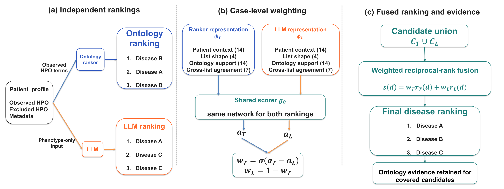

# Learning to Fuse LLMs with Ontology Rankers for Rare-Disease Diagnosis

<p align="center">
  
</p>

Code for the two main methods: publication-source correction and case-level ontology and LLM fusion.

## Project structure

```text
.
├── README.md
├── overview.png
├── requirements.txt
└── src/
    ├── lopo.py       # remove disease-phenotype relations supported only by the case publication
    ├── gate.py       # 39-feature representation, shared scorer, and weighted rank fusion
    └── train.py      # leave-one-backbone-family-out training and evaluation
```

## Setup

```bash
pip install -r requirements.txt
```

The code expects HPO `hp.json` and `phenotype.hpoa`, phenotype-only case inputs, publication-disjoint splits, and precomputed disease rankings from the ontology tool and LLMs.

## Publication-source correction

For a case from PMID `P`, leave-one-publication-out (LOPO) filtering removes a disease-phenotype relation only when `P` is its sole recorded source. Relations supported by another publication remain available.

```bash
python src/lopo.py \
  --hpoa /path/to/phenotype.hpoa \
  --pmid 12345678 \
  --output /path/to/filtered/phenotype.hpoa
```

Run the ontology ranker against the filtered file for that case publication.

## Fusion gate

`train.py` fits the shared scorer after excluding the target LLM and every model in its backbone family. The model manifest has this form:

```json
{
  "models": {
    "model_a": {"family": "family_a", "ranking": "ranked_model_a.json"},
    "model_b": {"family": "family_b", "ranking": "ranked_model_b.json"}
  }
}
```

Each ranking file maps a case ID to `[[disease_id, score], ...]`. Then run:

```bash
python src/train.py \
  --hp /path/to/hp.json \
  --hpoa /path/to/phenotype.hpoa \
  --cases /path/to/cases_full.jsonl \
  --views /path/to/input_view.jsonl \
  --splits /path/to/splits.json \
  --tool-ranking /path/to/ranked_ontology_lopo.json \
  --models /path/to/models.json \
  --target model_a \
  --output runs/model_a
```

The output contains the trained gate, fused disease rankings, and Recall@1.
